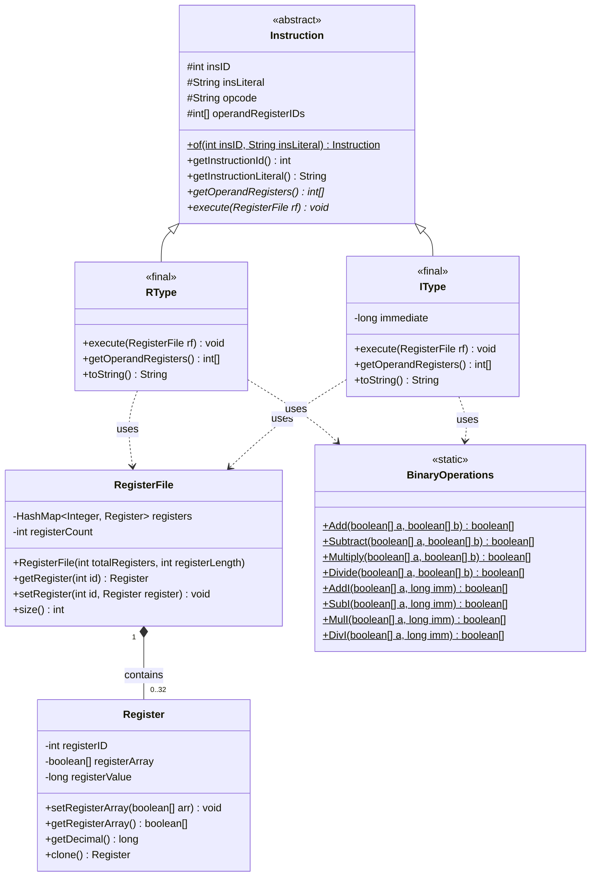

As required by course CSX3007 Computer Architecture from Assumption University School of Science and Engineering.

## Class Diagram

```mermaid
classDiagram
    class Instruction {
        <<abstract>>
        #int insID
        #String insLiteral
        #String opcode
        #int[] operandRegisterIDs
        +of(int insID, String insLiteral)$ Instruction
        +getInstructionId() int
        +getInstructionLiteral() String
        +getOperandRegisters()* int[]
        +execute(RegisterFile rf)* void
    }

    class RType {
        <<final>>
        +execute(RegisterFile rf) void
        +getOperandRegisters() int[]
        +toString() String
    }

    class IType {
        <<final>>
        -long immediate
        +execute(RegisterFile rf) void
        +getOperandRegisters() int[]
        +toString() String
    }

    class RegisterFile {
        -HashMap~Integer, Register~ registers
        -int registerCount
        +RegisterFile(int totalRegisters, int registerLength)
        +getRegister(int id) Register
        +setRegister(int id, Register register) void
        +size() int
    }

    class Register {
        -int registerID
        -boolean[] registerArray
        -long registerValue
        +setRegisterArray(boolean[] arr) void
        +getRegisterArray() boolean[]
        +getDecimal() long
        +clone() Register
    }

    class BinaryOperations {
        <<static>>
        +Add(boolean[] a, boolean[] b)$ boolean[]
        +Subtract(boolean[] a, boolean[] b)$ boolean[]
        +Multiply(boolean[] a, boolean[] b)$ boolean[]
        +Divide(boolean[] a, boolean[] b)$ boolean[]
        +AddI(boolean[] a, long imm)$ boolean[]
        +SubI(boolean[] a, long imm)$ boolean[]
        +MulI(boolean[] a, long imm)$ boolean[]
        +DivI(boolean[] a, long imm)$ boolean[]
    }

    Instruction <|-- RType
    Instruction <|-- IType
    RType ..> RegisterFile : uses
    IType ..> RegisterFile : uses
    RegisterFile "1" *-- "0..32" Register : contains
    RType ..> BinaryOperations : uses
    IType ..> BinaryOperations : uses
```
