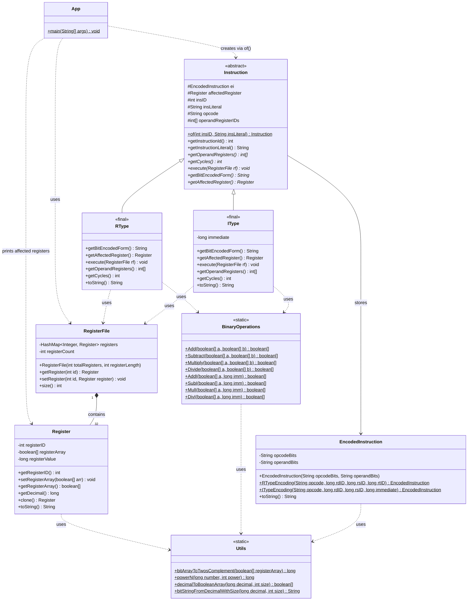

As required by course CSX3007 Computer Architecture from Assumption University School of Science and Engineering.

## Running The Simulator

From the project root, run:

```bash
./gradlew :app:run --args="<file.asm> [register-size]"
```

- `file.asm` is required.
- `register-size` is optional and accepts only `32` or `64`.
- If `register-size` is omitted, the simulator uses `32`.

Examples:

```bash
./gradlew :app:run --args="test_asm.txt"
./gradlew :app:run --args="test_asm.txt 32"
./gradlew :app:run --args="test_asm.txt 64"
```

## Clean Workspace

Generated outputs are already ignored by git (`build`, `.gradle`, `.kotlin`).

To clean local build artifacts:

```bash
./gradlew clean
```

To also clear Gradle's local project cache in this repo:

```bash
rm -rf .gradle
```

## Build Modes

Default dev checks (fast):

```bash
./gradlew :app:check
```

Release-style checks (enables ErrorProne, PMD, SpotBugs):

```bash
./gradlew :app:check -Prelease=true
```

You can also run a normal build with release analysis enabled:

```bash
./gradlew :app:build -Prelease=true
```

## Class Diagram



## Benchmarks (JMH)

Benchmark sources are under `app/src/jmh/java/org/mips/benchmarks/`.

- `BinaryOperationsBenchmark`
  : measures `Add`, `Multiply`, `Divide`.
- `InstructionExecutionBenchmark`
  : measures `Instruction.execute(...)` for high-level instruction paths and parser cost via `Instruction.of(...)`.

Run all benchmarks:

```bash
./gradlew :app:jmh
```

Run a single benchmark method:

```bash
./gradlew :app:jmh -Pjmh='org.mips.benchmarks.BinaryOperationsBenchmark.add32'
```
