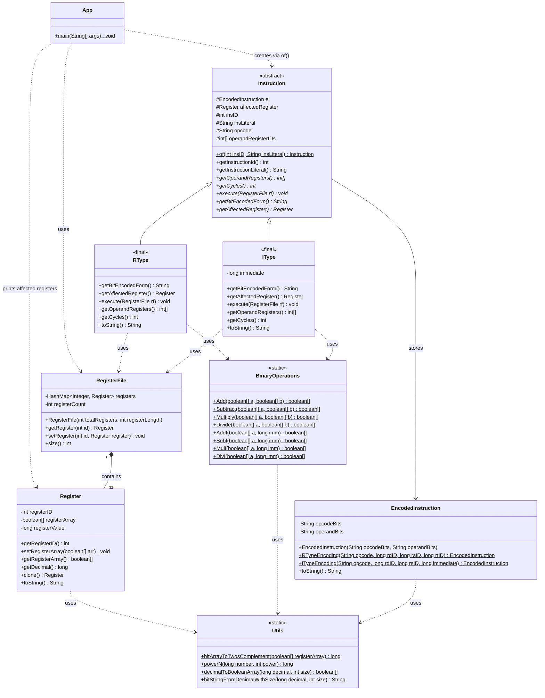

# MIPS Simulator Specification

## Class Diagram



## Instruction Format

```
<program>     ::= { <line> }
<line>        ::= <line-number> <instruction>

<line-number> ::= <non-zero-digit> { <digit> }

<instruction> ::= <r-instruction> | <i-instruction> | <pseudo-instruction>

<r-instruction>      ::= <r-opcode> <register> "," <register> "," <register>
<i-instruction>      ::= <i-opcode> <register> "," <register> "," <signed-number>
<pseudo-instruction> ::= "mov" <register> "," <register>

<r-opcode>    ::= "add" | "sub" | "mul" | "div"
<i-opcode>    ::= "addi" | "subi" | "muli" | "divi"

<register>    ::= "r" <register-number>
<register-number> ::= "0"
                    | <non-zero-digit> { <digit> }   (* 1–9 *)
                    | "1" <digit>                    (* 10–19 *)
                    | "2" <digit>                    (* 20–29 *)
                    | "3" ( "0" | "1" )              (* 30–31 *)

<signed-number>  ::= [ "-" ] <number>
<number>         ::= "0" | <non-zero-digit> { <digit> }

<non-zero-digit> ::= "1" | "2" | "3" | "4" | "5" | "6" | "7" | "8" | "9"
<digit>          ::= "0" | <non-zero-digit>
```

### Instruction Semantics

| Instruction        | Operation     | Notes                                                            |
| ------------------ | ------------- | ---------------------------------------------------------------- |
| `add rd, rs, rt`   | rd = rs + rt  | Raises exception on overflow/underflow                           |
| `sub rd, rs, rt`   | rd = rs − rt  | Implemented as rs + (−rt)                                        |
| `mul rd, rs, rt`   | rd = rs × rt  | Sign-magnitude multiplication                                    |
| `div rd, rs, rt`   | rd = rs ÷ rt  | Integer (truncated) division; raises exception on divide-by-zero |
| `addi rd, rs, imm` | rd = rs + imm | Immediate addition                                               |
| `subi rd, rs, imm` | rd = rs − imm | Immediate subtraction                                            |
| `muli rd, rs, imm` | rd = rs × imm | Immediate multiplication                                         |
| `divi rd, rs, imm` | rd = rs ÷ imm | Immediate division                                               |
| `mov rd, rs`       | rd = rs       | Pseudo-instruction; assembler expands to `add rd, rs, r0`        |

### Operand Conventions

- **rd** — destination register (result is written here)
- **rs** — first source register
- **rt** — second source register
- **imm** — immediate (integer literal) value
- Registers are named `r0` through `r31`
- All values are stored as two's complement signed integers

### Error Conditions

- `add`/`sub`/`addi`/`subi`: throws on signed overflow or underflow
- `div`/`divi`: throws on division by zero
- All operations: throws if the two source registers differ in bit-width

### Caveats

- Writes to `r0` are always silently ignored. It is hardwired to zero.

---

## Opcode Encoding

| Mnemonic | Opcode   |
| -------- | -------- |
| `mov`    | `000000` |
| `add`    | `000001` |
| `sub`    | `000010` |
| `mul`    | `000011` |
| `div`    | `000100` |
| `addi`   | `000101` |
| `subi`   | `000110` |
| `muli`   | `000111` |
| `divi`   | `001000` |

---

## CLI Invocation

Run format:

```bash
./gradlew :app:run --args="<file.asm> [register-size]"
```

- `<file.asm>` is required.
- `[register-size]` is optional.
- Supported register sizes: `32` and `64` only.
- If register size is omitted, the simulator uses `64`.

Examples:

```bash
./gradlew :app:run --args="test_asm.txt"
./gradlew :app:run --args="test_asm.txt 32"
./gradlew :app:run --args="test_asm.txt 64"
```

Invalid optional sizes cause an argument error.

---

## CPI (Clocks Per Instruction)

CPI measures how many clock cycles each instruction takes to complete. In a real pipelined processor,
CPI approaches 1 when there are no hazards. This simulator models a simple non-pipelined (single-cycle)
CPU where each instruction takes a fixed number of clock cycles.

### CPI Table

| Instruction    | CPI | Rationale                                                        |
| -------------- | --- | ---------------------------------------------------------------- |
| `add`, `sub`   | 1   | Simple ALU operation; single adder pass                          |
| `addi`, `subi` | 1   | Same path as add/sub; immediate requires no extra register fetch |
| `mul`, `muli`  | 4   | Iterative shift-and-add; proportional to register bit-width      |
| `div`, `divi`  | 4   | Iterative long division                                          |
| `mov`          | 1   | Expands to `add rd, rs, r0`; same cost as add                    |

### Calculating Overall Performance

Given a program with $N$ instructions:

$$\text{Total Cycles} = \sum_{i=1}^{N} \text{CPI}_i$$

$$\text{Execution Time} = \text{Total Cycles} \times T_{clock}$$

where $T_{clock}$ is the period of one clock cycle (e.g. 1 ns for a 1 GHz CPU).

### Implementation

The simulator tracks CPI per instruction and accumulates a **total cycle count** internally over the program.

**Per-instruction output:**
The simulator prints a fixed-width table with these columns:

- PC
- Decoded
- Encoded instructions (32-bit)
- Clock cycles

Each row corresponds to one instruction.

**Post-execution output:**
After all instruction rows are printed, the simulator prints the affected registers captured during execution as:

```
r<N> -> <bit-array>
```

**Program summary:**
After all instructions complete, the average CPI is printed as a single line:

```
CPI : <average>
```

where `<average>` is the total accumulated cycles divided by the instruction count, formatted to two decimal places.
